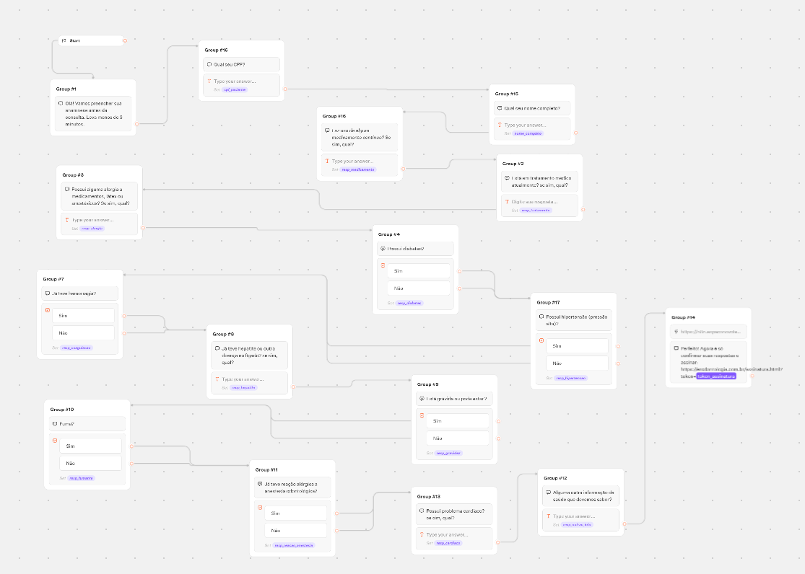
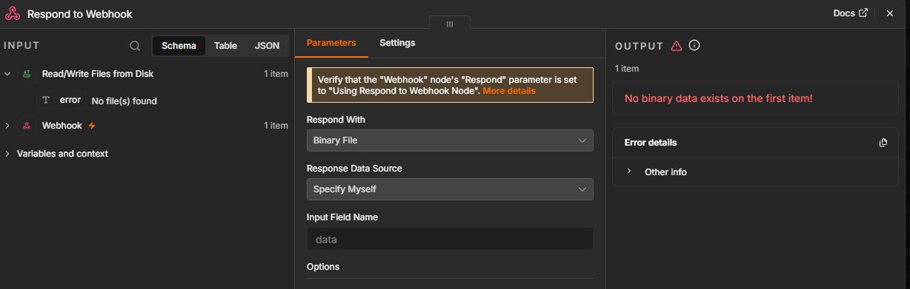

#  — Anamnese via WhatsApp com assinatura caseira

> ⚠️ **Arquitetura legada.** Este guia descreve o fluxo original (Evolution API + n8n + Typebot + `assinatura.html` estático), útil só pra clínicas que ainda estejam configuradas assim. Toda clínica nova usa o motor de conversa próprio do app (`app/`), que cobre não só a anamnese como agenda com confirmação/lembrete automático, atestados e prescrições com assinatura digital, orçamentos, tratamentos, financeiro do paciente, despesas e próteses — tudo sem n8n/Typebot. Ver `app/README.md`, seção "Duas formas de uma clínica funcionar".

Arquitetura completa (você já tem as partes 1 e 2):

```
Paciente (WhatsApp)
   │
   ▼
1. Evolution API  ──▶  2. n8n (ponte de conversa)  ──▶  3. Typebot (perguntas da anamnese)
                              │
                              │  ao terminar as perguntas
                              ▼
                    4. n8n › Webhook "salvar-anamnese"
                       gera um token e guarda as respostas
                              │
                              ▼
                    5. n8n envia, via Evolution API, o link:
                       https://SEUDOMINIO/assinatura.html?token=XYZ
                              │
                              ▼
6. Paciente abre o link no navegador (fora do WhatsApp)
   → página assinatura.html revisa as respostas e captura a assinatura
                              │
                              ▼
                    7. n8n › Webhook "obter-anamnese/:token"  (GET, chamado pela página)
                    8. n8n › Webhook "assinatura"              (POST, recebe o PDF assinado)
                       calcula hash, salva o PDF, registra o log, avisa a clínica
```

As partes 1–3 (Evolution API + n8n + Typebot conversando) você já tem. Este guia cobre as partes **3 (estrutura do fluxo no Typebot)**, **4/7/8 (os 3 webhooks no n8n)** e **6 (hospedar a página assinatura.html)**.

---

## 1. Estrutura do fluxo no Typebot

O Typebot é no-code, então aqui vai a lista de blocos a montar — sem código, é só arrastar na interface deles.

**Bloco 1 — Boas-vindas**
Bolha de texto: *"Olá! Vamos preencher sua anamnese antes da consulta. Leva menos de 3 minutos."*

**Blocos 2 em diante — uma pergunta por bloco**
Use blocos de **Input** (texto curto, ou "Choice" para sim/não). Sugestão de perguntas para anamnese odontológica — ajuste conforme o protocolo da clínica:

- Está em tratamento médico atualmente? Qual?
- Faz uso de algum medicamento contínuo? Qual?
- Possui alguma alergia a medicamentos, látex ou anestésicos?
- Possui diabetes?
- Possui hipertensão (pressão alta)?
- Possui problema cardíaco?
- Possui problema de coagulação sanguínea?
- Já teve hepatite ou outra doença no fígado?
- Está grávida ou pode estar? *(se aplicável)*
- Fuma?
- Já teve reação alérgica a anestesia odontológica?
- Alguma outra informação de saúde que devemos saber?

Para cada bloco de Input, dê um **nome de variável** claro (ex.: `resp_alergia`, `resp_diabetes`) — você vai precisar delas no próximo passo.

**Bloco final — enviar para o n8n**
Adicione um bloco **Webhook/HTTP request** (nativo do Typebot) configurado como `POST` para:

```
{N8N_BASE_URL}/webhook/salvar-anamnese
```

Corpo da requisição (JSON), usando as variáveis do Typebot:

```json
{
  "patient_name": "{{nome_paciente}}",
  "patient_phone": "{{telefone_paciente}}",
  "answers": [
    { "question": "Está em tratamento médico atualmente?", "answer": "{{resp_tratamento}}" },
    { "question": "Faz uso de medicamento contínuo?", "answer": "{{resp_medicamento}}" },
    { "question": "Possui alergia a medicamentos, látex ou anestésicos?", "answer": "{{resp_alergia}}" }
  ]
}
```

> Repita esse padrão para todas as perguntas que você adicionou.

Configure o Typebot para salvar a **resposta desse webhook** (ele vai devolver `{ "token": "..." }") numa variável, por exemplo `token_assinatura`.

**Último bloco — enviar o link**
Bolha de texto:
*"Perfeito! Agora é só confirmar suas respostas e assinar: https://SEUDOMINIO/assinatura.html?token={{token_assinatura}}"*

Esse link é o que o n8n vai repassar via Evolution API para o WhatsApp do paciente (se seu bridge n8n↔Typebot já retransmite as bolhas de texto do Typebot para o WhatsApp automaticamente, não precisa fazer nada a mais aqui).

---

## 2. Os 3 webhooks no n8n

### Webhook A — `POST /webhook/salvar-anamnese`
Chamado pelo Typebot ao final da conversa.

| Nó | Configuração |
|---|---|
| **Webhook** | Method: `POST`, Path: `salvar-anamnese`, Response Mode: "Using Respond to Webhook node" |
| **Crypto** (ou **Code**) | Gera um token único: `crypto.randomUUID()` (nó Code) ou um nó de geração de UUID, se seu n8n tiver |
| **Set** | Monta o objeto final: `{ token, patient_name, patient_phone, answers, created_at: now }` |
| **Convert to File** | Converte o JSON acima em arquivo (`.json`) |
| **Read/Write Files from Disk** | Grava em `/data/anamnese/{{ $json.token }}.json` (Operation: Write) |
| **Respond to Webhook** | Retorna `{ "token": "{{ $json.token }}" }` para o Typebot |

> Se preferir, troque os nós de arquivo por um nó de banco de dados (Postgres, Airtable, Google Sheets) — a lógica é a mesma, só muda onde você guarda o registro.

### Webhook B — `GET /webhook/anamnese/:token`
Chamado pela página `assinatura.html` quando o paciente abre o link.

| Nó | Configuração |
|---|---|
| **Webhook** | Method: `GET`, Path: `anamnese/:token` |
| **Read/Write Files from Disk** | Lê `/data/anamnese/{{ $json.params.token }}.json` (Operation: Read) |
| **Respond to Webhook** | Retorna o conteúdo do arquivo como JSON. Se não existir, retorne status 404 com uma mensagem clara |

### Webhook C — `POST /webhook/assinatura`
Chamado pela página `assinatura.html` quando o paciente confirma a assinatura.

| Nó | Configuração |
|---|---|
| **Webhook** | Method: `POST`, Path: `assinatura`, **marque a opção que expõe os headers** (você vai usar o IP) |
| **Convert to File** | Operation: "Move Base64 String to File" — campo de origem: `pdf_base64`, gera um binário PDF |
| **Crypto** | Operation: "Hash", Type: `SHA256`, aplicado sobre o binário do PDF — isso vira a "impressão digital" do documento |
| **Read/Write Files from Disk** | Grava o binário em `/data/assinaturas/{{ $json.token }}.pdf` |
| **Set** | Monta o registro de auditoria: `token, name, cpf, signed_at_client, signed_at_server: now, ip: {{ $json.headers["x-forwarded-for"] }}, user_agent: {{ $json.headers["user-agent"] }}, sha256: {{ $json.hash }}` |
| **Convert to File + Read/Write Files from Disk** | Grava esse registro em `/data/assinaturas/{{ $json.token }}.log.json` (é a sua trilha de evidência) |
| **HTTP Request** *(opcional)* | Chama a Evolution API para avisar a clínica/paciente no WhatsApp: "Anamnese assinada com sucesso ✅" |
| **Respond to Webhook** | Retorna `200 OK` para a página |

> **Nomes de nós podem variar um pouco conforme a versão do seu n8n** (por exemplo "Move Binary Data" em versões mais antigas no lugar de "Convert to File"). Se algum nó não existir exatamente com esse nome, procure o equivalente mais próximo — a lógica (webhook → converter base64 em arquivo → hash → salvar → responder) é o que importa.

---

## 3. Hospedando a página `assinatura.html`

É um arquivo estático — não precisa de servidor especial. Três opções simples:

- **Mais simples:** suba o arquivo num serviço de hospedagem estática gratuito (Cloudflare Pages, Netlify, Vercel, GitHub Pages) e aponte um subdomínio tipo `assinatura.suaclinica.com.br`.
- **Direto no seu servidor do n8n:** se você já tem um Nginx/Caddy na frente do n8n, sirva o arquivo como um site estático simples no mesmo domínio.
- **Pelo próprio n8n:** dá pra criar um 4º webhook (`GET /webhook/assinatura-page`) que devolve o HTML como resposta — funciona, mas é mais frágil para manutenção do que um arquivo estático de verdade.

Antes de publicar, edite as duas linhas no topo do HTML:

```js
window.APP_CONFIG = {
  N8N_BASE_URL: "https://SEU-N8N-AQUI.com",
  CLINIC_NAME: "Nome real da clínica"
};
```

---

## 4. Checklist de LGPD (dado sensível de saúde)

- [ ] O servidor onde `/data/anamnese` e `/data/assinaturas` ficam tem disco criptografado e acesso restrito.
- [ ] Existe uma política de por quanto tempo esses arquivos ficam guardados (prontuário odontológico costuma ter prazo mínimo legal — confirme com o responsável da clínica).
- [ ] O link de assinatura não deve ser indexável nem previsível — por isso o token é um UUID aleatório, não um número sequencial.
- [ ] Considere expirar o token (e apagar o JSON de resposta) depois de X dias se a assinatura não for concluída.
- [ ] O texto de consentimento na página já cobre LGPD para o *ato de assinar*; a política de privacidade da clínica (como um todo) é um documento separado que deve existir independentemente disso.

---

## 5. Nota sobre a força jurídica desta solução

Isso implementa uma **assinatura eletrônica simples**, válida no Brasil pela MP 2.200-2/2001 e pela Lei 14.063/2020 — não é uma "assinatura digital" com certificado ICP-Brasil. A diferença prática: se um dia essa assinatura for contestada, quem precisa demonstrar a integridade do processo (hash do PDF, IP, timestamp do servidor, log de auditoria) é a própria clínica — por isso os passos de gerar o SHA-256 e guardar o log não são opcionais, são a parte que sustenta a validade em caso de disputa. Não sou advogado; se a clínica quiser reforçar ainda mais essa camada, vale uma conversa rápida com o jurídico responsável.
